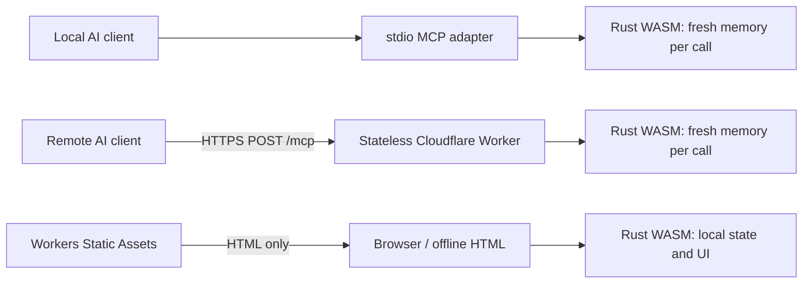

# QuietScore

**Clear severity. Quiet data.** A standalone CVSS 4.0 calculator and MCP server powered by one dependency-free Rust engine compiled to WebAssembly.

The browser calculator explains every classification, validates pasted vectors, updates the score as metrics change, and exports re-importable text or JSON. AI clients can use the same engine through local stdio MCP or optional Cloudflare-hosted MCP.

## What is implemented

- All 32 CVSS 4.0 Base, Threat, Environmental, and Supplemental metrics.
- Exact FIRST MacroVector lookup/interpolation scoring, not an approximation.
- Strict vector validation, canonical metric ordering, and specific errors for missing, duplicate, unknown, or invalid metrics.
- Plain-language explanations, classification comparisons, keyboard-accessible tabs/radios, responsive layout, and live scores.
- Text/JSON export and local file import. Supplied score fields are ignored and recalculated.
- A self-contained offline HTML file with embedded WebAssembly and FIRST's license.
- Three read-only MCP tools over stdio or stateless Streamable HTTP.
- Cloudflare Workers configuration with static assets, bounded request bodies, optional bearer authentication, restricted browser origins, no assessment persistence, and application observability disabled.

CVSS communicates **vulnerability severity**. It does not measure exploitation probability or replace a complete business-risk assessment. The example provided for development scores **7.6 (High)**:

```text
CVSS:4.0/AV:N/AC:L/AT:P/PR:N/UI:P/VC:H/VI:H/VA:N/SC:N/SI:N/SA:N
```

## Trusted CVSS sources and acknowledgments

CVSS-related scoring, metric classifications, defaults, severity bands, and contextual guidance are grounded in **FIRST's official materials**. No third-party blog, vendor reinterpretation, or live AI-generated explanation is used as a scoring authority.

1. [FIRST CVSS 4.0 Specification](https://www.first.org/cvss/v4.0/specification-document), document version 1.2 when checked: authoritative definitions, values, vector syntax, severity bands, and algorithm.
2. [FIRST CVSS 4.0 User Guide](https://www.first.org/cvss/v4.0/user-guide): assessment practices, publication requirements, and the distinction between severity and risk.
3. [FIRST Consumer Implementation Guide](https://www.first.org/cvss/v4.0/implementation-guide): applying the system in consumer environments.
4. [FIRST Examples](https://www.first.org/cvss/v4.0/examples) and [FAQ](https://www.first.org/cvss/v4.0/faq): supporting scoring context and interpretation.
5. [FIRST official calculator source](https://github.com/FIRSTdotorg/cvss-v4-calculator/tree/c5b0d409ae9f57c44264c6ce5f27d89298e1d32a): the pinned reference implementation, scoring tables, maximum-severity data, and metric configuration.

Sources were checked on **October 3, 2026**. The bundled source revision is **`c5b0d409ae9f57c44264c6ce5f27d89298e1d32a`**. `reference/provenance.json` records SHA-256 hashes. `scripts/verify-sources.cjs` verifies those hashes and checks every allowed metric value against FIRST's configuration.

**Acknowledgment:** CVSS is owned and maintained by FIRST.Org, Inc. Reference code and data are credited to FIRST.ORG, Inc., Red Hat, and contributors and distributed under **BSD-2-Clause**. The full copyright, conditions, and disclaimer are retained in `FIRST-LICENSE`, the static distribution, and the offline HTML. QuietScore is independent; FIRST endorsement or certification is not implied.

The interface and MCP explanations are **plain-language paraphrases**, not verbatim normative definitions. FIRST's specification takes precedence if a simplification is ambiguous. Provider Urgency labels are provider-defined, not standardized response deadlines. Supplemental metrics never modify the score. No metric descriptions or tables are fetched at runtime.

When updating CVSS data: choose an explicit upstream commit, review its license and changes, update the vendored files and provenance hashes, regenerate Rust tables, review affected explanations, run the source/parity/MCP checks, and publish a new version. Do not silently track an upstream branch in production.

## Privacy: choose the appropriate mode

**Offline calculator:** Open `dist/quietscore-offline.html` from disk, preferably with networking disabled. Calculation, validation, rendering, imported files, and current state remain on the device. No host is contacted to run the calculator.

**Hosted browser calculator:** Only the application document/assets are loaded from the host. The calculator never calls `/mcp` or any scoring API. There are no analytics, external scripts/fonts, cookies or assessment uploads. Explicitly saved scenario drafts use localStorage in this browser profile; they are not encrypted or synced. CSP blocks outgoing connections with `connect-src 'none'`. Vectors never enter URLs. The host can still see page-request metadata and may keep access logs.

**Local MCP:** `mcp/stdio.ts` runs on the client's machine without a network server or scoring-service requests. The AI client can still disclose vectors to its own model provider; its privacy policy is outside QuietScore's control.

**Hosted MCP:** An AI client sends its vector over HTTPS to Cloudflare for server-side calculation. This is necessarily remote processing and is **not equivalent to the offline privacy promise**. The Worker does not store, cache, or log assessments and creates fresh WASM memory per tool call. Platform access/security metadata and AI-provider handling remain outside the application's control. Use local MCP for assessments that must never reach Cloudflare.

Downloads and clipboard writes happen only when requested. Browser extensions, malware, device/clipboard synchronization, and explicitly invoked browser agents remain outside the application's privacy boundary. The optional browser WebMCP tool applies vectors locally; it is distinct from the remote MCP endpoint.

## Architecture



There is one Rust crate and one vector/scoring implementation. The browser embeds the compiled module. Node stdio and Cloudflare import the same build output. JavaScript/TypeScript adapters handle browser APIs and the official MCP SDK's transport; there is no JavaScript scoring fallback. A website still requires HTML/CSS and a small browser bridge, so this is not a claim of literally zero JavaScript.

Project layout:

```text
src/                  Rust parsing, scoring, explanations, state, UI/report rendering
reference/            Pinned FIRST files and SHA-256 provenance
scripts/              Generation, packaging, source/parity/file verification
bridge.js, style.css  Browser APIs and responsive presentation
mcp/                  Shared tool registration, WASM adapter, local stdio entry
worker/               Cloudflare entry, authentication, origins, request bounds
tests/               MCP client and HTTP routing tests
generated/           Built WASM for MCP adapters (ignored)
dist/                Self-contained website/offline distribution
wrangler.jsonc        Cloudflare assets + Worker configuration
```

The Rust crate has **no third-party crate dependencies**. MCP adapters use the official TypeScript SDK and Zod; Wrangler/TypeScript/tsx are development tools. MCP HTTP serving supports the SDK's current 2026-07-28 revision plus stateless compatibility for 2025 Streamable HTTP clients. No Durable Object, protocol session store, KV, D1, R2, Queue, AI model, or external scoring service is required.

## Build and verify

Requirements: Node.js 22+, pnpm 10, Python 3, and Rust with the `wasm32-unknown-unknown` target.

```sh
cd /home/home/github/quietscore
rustup target add wasm32-unknown-unknown
pnpm install
pnpm build
pnpm typecheck
pnpm test
pnpm deploy:check
```

`pnpm build` generates guidance/tables, compiles Rust, embeds WASM into HTML, and creates `generated/quietscore.wasm`. `pnpm deploy:check` bundles a **dry run** without publishing. If pnpm reports skipped official `esbuild`/`workerd` installation scripts, run `pnpm rebuild esbuild workerd` before the dry run.

Checks cover Rust parsing/boundaries, all **104,976 possible Base vectors** and **12,000 deterministic optional-metric combinations** against FIRST, source hashes and classifications, text/JSON roundtrips, invalid files/vectors, fresh-memory isolation, HTTP MCP clients in both protocol modes, local stdio, and Worker authentication/origin/body-limit behavior. The Worker was also exercised in Cloudflare’s local workerd runtime with official MCP clients in both protocol modes. Functional verification is not an independent security audit or FIRST certification.

The existing static preview remains a separate owner-private Sites deployment. `.openai/hosting.json` preserves its identity; Cloudflare uses `wrangler.jsonc` and does not require Sites. The project has its own Git history and no dependency on the former DBHub checkout.

## MCP tools and client setup

All tools are read-only, deterministic, non-destructive, and use bundled data:

- **`cvss_calculate({ vector })`** returns `valid`, canonical `vector`, `cvssVersion`, numeric `score`, `severity`, score `nomenclature`, and the FIRST source URL. Invalid vectors return an MCP tool error with `valid: false` and an explanation.
- **`cvss_explain({ vector })`** adds all 32 metrics' selected values, effective values/defaults, labels, groups, explanations, and whether each affects scoring.
- **`cvss_metric({ metric: "AT" })`** describes one metric and all allowed classifications. Use official metric codes, such as `AV`, `UI`, `MSI`, or `U`.

Example calculate arguments:

```json
{ "vector": "CVSS:4.0/AV:N/AC:L/AT:P/PR:N/UI:P/VC:H/VI:H/VA:N/SC:N/SI:N/SA:N" }
```

### Local stdio — recommended for sensitive assessments

Build first, then run `pnpm mcp:stdio` for development. For a client's stdio configuration, use the executable directly so package-manager banners do not reach protocol stdout:

```json
{
  "mcpServers": {
    "quietscore": {
      "command": "/home/home/github/quietscore/node_modules/.bin/tsx",
      "args": ["/home/home/github/quietscore/mcp/stdio.ts"]
    }
  }
}
```

Adjust absolute paths for another machine. The server writes only protocol messages to stdout and does not print assessments.

### Remote Streamable HTTP

After deploying Cloudflare, connect the client's remote MCP settings to:

```text
https://quietscore.<your-workers-subdomain>.workers.dev/mcp
```

For clients supporting URL/header configuration:

```json
{
  "mcpServers": {
    "quietscore": {
      "url": "https://quietscore.<your-workers-subdomain>.workers.dev/mcp",
      "headers": { "Authorization": "Bearer <your-token>" }
    }
  }
}
```

Field names vary by client. Choose **Streamable HTTP**, not the deprecated standalone SSE transport. This implementation uses a pre-provisioned bearer token, not OAuth discovery or user identities. OAuth-only clients need an OAuth-capable gateway or an explicitly public endpoint; a login flow is not implemented here.

## Cloudflare free-tier deployment plan

Use **one Worker with Workers Static Assets**. The calculator/offline download are served as static files; only `/mcp`, `/mcp/*`, and `/healthz` invoke the Worker first. Browser calculations stay local regardless of the remote endpoint. No paid persistence or background services are needed.

At the time of verification, Cloudflare's [official static-assets billing documentation](https://developers.cloudflare.com/workers/static-assets/billing-and-limitations/) states that static requests are free/unlimited. The [Workers Free plan](https://developers.cloudflare.com/workers/platform/pricing/) provides **100,000 Worker requests per day**, shared across the account, with a **10 ms CPU allowance per invocation**; [memory is limited to 128 MB](https://developers.cloudflare.com/workers/platform/limits/). These are platform limits, not a promise of unlimited free MCP use. Confirm current limits before launch and measure real production CPU; local tests do not prove the Cloudflare CPU budget. Quota exhaustion can affect MCP while static calculator assets remain independently available. A custom domain is optional; the `workers.dev` address avoids requiring a purchased domain.

1. **Build and validate** using the commands above.
2. **Preview locally:** copy `.dev.vars.example` to `.dev.vars`, choose a strong local-only token, and run `pnpm dev`. Connect an MCP client to the printed local `/mcp` URL with that token. Never commit `.dev.vars`.
3. **Authorize your Cloudflare account:** run `node scripts/wrangler.mjs login` interactively.
4. **Configure hosted authentication:** run `node scripts/wrangler.mjs secret put MCP_AUTH_TOKEN`; paste a long random token into its hidden prompt. Do not put the token in source or command arguments.
5. **Deploy:** run `pnpm run deploy`. This publishes the static calculator plus MCP endpoint into your Cloudflare account. Deployment is prepared here, but no Cloudflare production deployment or account login is performed automatically.
6. **Verify remotely:** connect the MCP Inspector or an AI client, list the three tools, calculate the example, check invalid-vector handling, and confirm unauthenticated calls fail. Inspect aggregate CPU/quota metrics without enabling assessment/body logging.

`ALLOW_PUBLIC_MCP` defaults to `"false"`: the endpoint returns 503 if no token is configured. To intentionally offer public scoring, set it to `"true"` and omit the token. A configured token is always enforced, even when that flag is true. Public requests can consume the shared free quota; there is no per-user rate-limit store or identity layer.

Requests with a browser `Origin` must match the Worker's origin or an explicit comma-separated `ALLOWED_ORIGINS` setting. Ordinary non-browser MCP clients usually omit Origin. Query strings on `/mcp` are rejected; clients must place vectors in POST bodies because a platform may record a URL before the Worker rejects it. Bodies are capped at 32 KB before SDK handling and individual vector inputs at 8 KB. Responses use `Cache-Control: no-store`. `/healthz` returns only `ok`; it requires no assessment or authentication.

The project’s Wrangler wrapper disables developer-CLI usage telemetry with `WRANGLER_SEND_METRICS=false`. `observability.enabled` is false and the application has no request/body/error logging or tracing calls. This does not disable all Cloudflare network/security metadata. Review account-level logging, proxies, gateways, and client telemetry before processing confidential vectors. Production multi-user OAuth, stronger abuse controls, and identity-based authorization should be designed separately if needed; none are required for the basic free-tier architecture.

Official deployment references: [Cloudflare stateless MCP guide](https://developers.cloudflare.com/agents/model-context-protocol/guides/remote-mcp-server/), [Wrangler configuration](https://developers.cloudflare.com/workers/wrangler/configuration/), and [Workers observability](https://developers.cloudflare.com/workers/observability/logs/workers-logs/).

## Portable assessments

JSON exports preserve the original `quiet-cvss` format identifier and schema version 1 for backward compatibility, despite the new QuietScore name. They contain `cvssVersion`, `vector`, `score`, `severity`, and `nomenclature`. Import also accepts a JSON object with a `vector` string. Text exports contain exactly one vector line, calculated severity, and selected metric explanations. Both are imported locally and rescored. Optional `X` values are omitted from the canonical vector because they have the same semantics as an omitted optional metric.

## Current delivery status

The standalone project, browser/offline build, local MCP, and Cloudflare Worker source/configuration are implemented. Remote Cloudflare MCP becomes available only after the deployment steps are completed in your account. The existing Sites preview serves the static calculator and does not expose the Cloudflare MCP endpoint.

## Project license

QuietScore’s own code is BSD-2-Clause (`LICENSE`). FIRST reference material retains its separate `FIRST-LICENSE` attribution and disclaimer. Dependency licenses remain with their respective packages.

## Guided scenarios, local drafts, and PDF

Choose **New guided scenario** to start from a fresh assessment, name it, and record evidence in notes. The wizard walks through all 11 required Base metrics, then the optional Threat, Environmental, and Supplemental metrics using the same FIRST-backed descriptions and Rust scoring engine as the calculator. Each Base step requires explicit confirmation; initial classifications are placeholders and scores remain provisional until Base review is complete. Optional steps can be skipped, keeping their existing selections. Switch to all metrics at any time, or guide an imported assessment.

**Save draft locally** creates or updates the current draft. **Save as new draft** creates a separate copy. Select a draft and choose **Open draft** to resume its vector, name, notes, and wizard position; the Rust engine revalidates and recalculates it. Deletion asks for confirmation. Changes are not automatically saved. Drafts are stored under `quietscore.drafts.v1` in localStorage, scoped to this origin and browser profile. Offline file storage behavior varies by browser; blocked/full storage produces an error and does not report success. Clearing site data deletes drafts. Draft contents are not encrypted: shared profiles and browser extensions may access them. JSON exports include scenario and metric notes; text exports include readable notes but text import restores only the vector. Wizard position remains in local drafts.

**PDF** opens the browser's native print dialog. Choose **Save as PDF** to download a report with the scenario name, notes, canonical vector, score, severity, all metric classifications and explanations, effective defaults, and FIRST attribution. This operates locally and adds no PDF library or network dependency. PDF is a human-readable report, not an import format. The browser controls print destinations and output settings; use Save as PDF rather than a remote print service for local output.

## Published sample scenarios

The opening screen centers on three use cases: **New guided scenario**, **Continue a draft**, and **Explore real vulnerabilities**. Vector/file import is a secondary expandable control. Samples open as read-only references: classifications and scenario details are locked, while metric tabs, guidance, copy, and export remain available. Choose **Clone as starting point** to create an editable assessment with source attribution retained; clones can be guided, saved locally, and exported. Source links also appear alongside the loaded sample.

Ten bundled public examples were verified on **4 October 2026**: nine disclosures published in 2026 and historical Log4Shell. `samples.json` records vectors, source scores, scoring authority, publication and verification dates, learning goals, and public source/advisory links. CNA metrics were read from the CVE Program’s official [cvelistV5 repository](https://github.com/CVEProject/cvelistV5); worked examples come from [FIRST’s CVSS 4.0 examples](https://www.first.org/cvss/v4.0/examples). These are attributed scenarios, not universal scores or automatic version conversions. Original prose is summarized rather than copied. No runtime feed or network fetch is used. Opening an external source link contacts that site.

- **CVE-2026-88771 — NetScaler remote command execution**, 9.5, NetScaler CNA; published 2026-09-27. [NetScaler CNA score / CVE Program](https://www.cve.org/CVERecord?id=CVE-2026-88771) · [Maintainer advisory / fix](https://support.citrix.com/support-home/kbsearch/article?articleNumber=CTX697096).
- **CVE-2026-88775 — NetScaler memory overflow**, 8.8, NetScaler CNA; published 2026-09-27. [NetScaler CNA score / CVE Program](https://www.cve.org/CVERecord?id=CVE-2026-88775) · [Maintainer advisory / fix](https://support.citrix.com/support-home/kbsearch/article?articleNumber=CTX697096&articleTitle=Citrix_NetScaler_ADC_and_Citrix_NetScaler_Gateway_Security_Bulletin_for_CVE_2026_88771_CVE_2026_88772_CVE_2026_88773_CVE_2026_88774_CVE_2026_88775_CVE_2026_88776_CVE_2026_88777_and_CVE_2026_88778).
- **CVE-2026-56705 — Adminer database connection injection**, 9.3, VulnCheck CNA; published 2026-08-25. [VulnCheck CNA score / CVE Program](https://www.cve.org/CVERecord?id=CVE-2026-56705) · [Maintainer advisory / fix](https://github.com/vrana/adminer/security/advisories/GHSA-r4x9-5m63-3vxw).
- **CVE-2026-18751 — Citrix Workspace for Mac file-path control**, 5.2, Citrix CNA; published 2026-08-18. [Citrix CNA score / CVE Program](https://www.cve.org/CVERecord?id=CVE-2026-18751) · [Maintainer advisory / fix](https://support.citrix.com/external/article/CTX696911).
- **CVE-2026-42903 — Windows Kerberos denial of service**, 7.1, FIRST worked example; published 2026-06-09. [FIRST worked example](https://www.first.org/cvss/v4.0/examples) · [CVE Program record](https://www.cve.org/CVERecord?id=CVE-2026-42903) · [Maintainer advisory / fix](https://msrc.microsoft.com/update-guide/vulnerability/CVE-2026-42903).
- **CVE-2026-48172 — LiteSpeed cPanel privilege escalation**, 10.0, mitre CNA; published 2026-05-21. [mitre CNA score / CVE Program](https://www.cve.org/CVERecord?id=CVE-2026-48172) · [Maintainer advisory / fix](https://blog.litespeedtech.com/2026/05/21/security-update-for-litespeed-cpanel-plugin/).
- **CVE-2026-31431 — Linux kernel CopyFail**, 8.5, FIRST worked example; published 2026-04-22. [FIRST worked example](https://www.first.org/cvss/v4.0/examples) · [CVE Program record](https://www.cve.org/CVERecord?id=CVE-2026-31431) · [Maintainer advisory / fix](https://git.kernel.org/stable/c/893d22e0135fa394db81df88697fba6032747667).
- **CVE-2026-39987 — marimo notebook authentication bypass**, 9.3, GitHub_M CNA; published 2026-04-09. [GitHub_M CNA score / CVE Program](https://www.cve.org/CVERecord?id=CVE-2026-39987) · [Maintainer advisory / fix](https://github.com/marimo-team/marimo/security/advisories/GHSA-2679-6mx9-h9xc).
- **CVE-2026-1731 — BeyondTrust remote code execution**, 9.9, BT CNA; published 2026-02-06. [BT CNA score / CVE Program](https://www.cve.org/CVERecord?id=CVE-2026-1731) · [Maintainer advisory / fix](https://www.beyondtrust.com/trust-center/security-advisories/bt26-02).
- **CVE-2021-44228 — Log4Shell · Apache Log4j**, 9.3, FIRST worked example; published 2021-12-10. [FIRST worked example](https://www.first.org/cvss/v4.0/examples) · [Apache Log4j security advisory](https://logging.apache.org/log4j/2.x/security.html#CVE-2021-44228) · [NVD record / original disclosure](https://nvd.nist.gov/vuln/detail/CVE-2021-44228).

Log4Shell uses FIRST’s historical Base + Threat scenario (9.3, `E:A`), not a 2026 disclosure or an original Apache CVSS 4.0 score. For Linux CopyFail, FIRST’s comparison table and recalculated vector give 8.5, while a nearby heading inconsistently says 10.0; we explicitly record this discrepancy. Its mitigation comparison is FIRST’s conditional environmental scenario (0.0), which requires the documented mitigation to be in place. It must not be treated as evidence that an arbitrary deployment is safe.

To update samples, verify publication dates and vectors against the named authority, keep distinct Base/Threat/Environmental contexts, preserve source attribution, and run the compiled-WASM sample tests. The library is a curated snapshot, not a list of the most prevalent threats.

## Appearance and accessibility

The **Appearance** selector defaults to the device’s light/dark color preference and also offers explicit Light, Dark, and High contrast modes. This preference is kept only for the current page session. The interface uses a coordinated indigo, teal, and plum palette. Semantic surface, text, border, and severity tokens keep controls consistent across modes. Severity also appears as text, so it does not depend on color alone. Increased-contrast preferences strengthen borders; forced-colors mode uses system colors and preserves visible focus and selected states. Motion is reduced when requested. Responsive layouts and wrapping controls accommodate small screens; native form controls follow the active color scheme. PDF reports retain a light print surface.

## Explainable assessments and Excel

Assessment notes have an **Expand notes** dialog for comfortable reading and editing. Guided steps and the full editor both offer optional, 2,000-character notes for each metric. Drafts preserve these notes; JSON exports include a backward-compatible `scenario` extension and restore it on import. Plain text and PDF include assessor notes. Excel exports include the entire assessment: scenario, general notes, numeric score, severity, vector, all 32 classifications, effective values, definitions, sample rationales, assessor notes, and source URLs. Excel is a static snapshot and does not recalculate CVSS when edited. Its XLSX archive is generated by Rust/WASM locally, with literal text cells rather than formulas.

Red, amber, and pale-yellow metric choices indicate higher, intermediate, and lower severity tendencies. Arrows and a legend convey the same meaning without color. These are comparative cues, not independent metric scores; Supplemental and Not defined choices remain neutral.

Each of the ten samples has context for every metric in `samples.json`, verified 4 October 2026 by following vendor advisories, CVE Program records, Apache guidance, and FIRST worked examples. Context explicitly separates source-supported facts, scoring interpretations, defaults, missing evidence, and source discrepancies. Source links sit beside each explanation and travel into Excel. Optional deployment and supplemental metrics remain Not defined unless the published vector sets them; absence is not proof of no risk or no exploitation. Original vector values are preserved even when prose differs.

The deeper review found two additional discrepancies: LiteSpeed describes a cPanel-account prerequisite while its published vector uses PR:N; NetScaler CVE-2026-88771 uses AT:P while the bulletin says no extra feature is needed and does not explain the execution condition. Adminer documents driver/writable-root prerequisites, and marimo documents edit/platform checks, although their vectors use AT:N. Workspace for Mac uses UI:A without describing the precise victim action. These evidence limits appear directly on the relevant metrics rather than being filled with invented details. Microsoft’s advisory required client-side rendering and the kernel patch link did not render through the research browser; the official CVE records and FIRST examples supplied the accessible context for those cases.

## Readable source and optimized builds

Maintained Rust, JavaScript, TypeScript, and CSS remain readable in the repository. Run `pnpm format` to format them and `pnpm format:check` before changes are submitted. Generated metric/lookup files and pinned FIRST reference files are excluded from the formatting pass; regenerate them through `pnpm build`. Rust requires the rustfmt component.

The release build uses size optimization, link-time optimization, one code-generation unit, stripped symbols, and aborting panics. Esbuild minifies browser JavaScript and CSS only when packaging the distribution; CSP hashes are computed from the final packaged scripts. These settings reduce shipped code without obscuring maintained source. Scoring changes must pass the exhaustive FIRST comparison; optimization is not a reason to change floating-point evaluation order. Edit source files rather than `dist/`.

## Automatic GitHub deployments

`.github/workflows/cloudflare.yml` validates every pull request targeting `main`. Every push to `main` (including merged pull requests) builds the optimized Rust/WASM application, checks formatting and TypeScript, compares scores with FIRST, tests exports and MCP, validates the Worker bundle, then deploys the `quietscore` Worker. A failed check prevents deployment. Deployments are serialized with GitHub’s `queue: max` (up to 100 waiting runs), so rapid pushes do not replace the single pending deployment; runs beyond GitHub’s queue limit require rerunning. Deployments can also be requested through GitHub Actions → Run workflow on `main`. Pull requests have no deployment step and do not receive Cloudflare credentials.

Set these once in GitHub repository Settings → Secrets and variables → Actions:

- Repository **secret** `CLOUDFLARE_API_TOKEN`: a Cloudflare Workers deployment API token restricted to the target account. Use the minimum Workers deployment permissions supported by Cloudflare; do not store the token in a file committed to Git or paste it in chat.
- Repository **variable** `CLOUDFLARE_ACCOUNT_ID`: the target Cloudflare account ID.

The workflow uses the project's locked Wrangler and dependencies, a pinned Rust toolchain, and commit-pinned GitHub actions. It checks the deployed health endpoint, calculator/privacy CSP, offline edition, and protected MCP endpoint. GitHub Actions provides build/deployment status and normal failed-workflow notifications. Configure required checks on `main` if you want GitHub to prevent merging failed changes. For rollback, redeploy a reviewed revert on `main`, or use Cloudflare deployment rollback and then reconcile the Git history before the next push. Do not also enable Workers Builds for this repository: that would create two competing deployment paths.

### Free-first production footprint

Use **one Cloudflare Worker with Static Assets**, a free `workers.dev` hostname, and the **Workers Free plan**. No KV, D1, R2, Durable Objects, queues, cron jobs, paid domain, analytics service, or Workers Builds are required. Ordinary calculator and offline-download requests are served as static assets; scoring, drafts, and exports stay in the browser. `/mcp` and `/healthz` invoke the Worker and use its Free-plan limits. Exhausting a Free-plan allowance can make these endpoints unavailable; this setup does not upgrade the plan automatically. GitHub Actions uses the GitHub account's included minutes; private repositories have a finite allowance. Keep GitHub spending limits at zero to prevent paid overages, or explicitly choose a public repository if unrestricted public-source visibility is acceptable.

Hosted MCP remains disabled until a secret is supplied. After the first deployment, use `pnpm exec wrangler secret put MCP_AUTH_TOKEN` to configure the bearer token interactively; keep `ALLOW_PUBLIC_MCP` false. Clients use `https://<worker>.workers.dev/mcp` with the bearer token. This token is separate from the Cloudflare deployment API token. Application logs/traces and Wrangler telemetry remain disabled under the calculator's privacy requirements.

References: [Cloudflare GitHub Actions deployment](https://developers.cloudflare.com/workers/ci-cd/external-cicd/github-actions/), [Workers pricing](https://developers.cloudflare.com/workers/platform/pricing/), [Static Assets billing](https://developers.cloudflare.com/workers/static-assets/billing-and-limitations/), and [Worker secrets](https://developers.cloudflare.com/workers/configuration/secrets/).

### Current production target

Calculator: [quietscore.cancun.workers.dev](https://quietscore.cancun.workers.dev). Hosted MCP: `https://quietscore.cancun.workers.dev/mcp`, requiring `Authorization: Bearer <MCP_AUTH_TOKEN>`. The initial deployment token is stored only on the setup machine at `/home/home/.config/quietscore/mcp-token` with owner-only permissions and in Cloudflare Worker secrets. Transfer it to an authorized AI client through its secure credential settings; never put it in a vector, URL, GitHub issue, or source file. Rotate with `pnpm exec wrangler secret put MCP_AUTH_TOKEN` if needed.

Source: [sethusrinivasan/quietscore](https://github.com/sethusrinivasan/quietscore). Production deploys from `main`; GitHub holds the Cloudflare account ID as a repository variable and requires a separate deployment API token secret. The bearer token survives normal Worker deployments and is not rebuilt from source.
