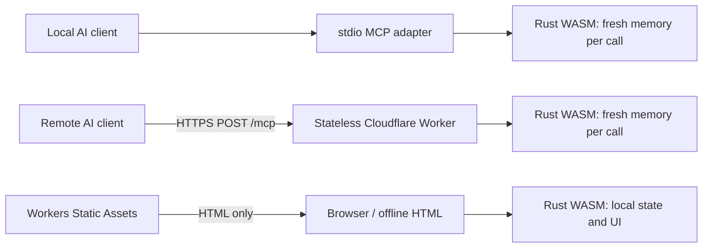

# QuietScore

**Clear severity. Quiet data.** A standalone CVSS 4.0 calculator and MCP server powered by one dependency-free Rust engine compiled to WebAssembly.

The browser calculator explains every classification, validates pasted vectors, updates the score as metrics change, and exports re-importable text or JSON. AI clients can use the same engine through local stdio MCP or optional Cloudflare-hosted MCP.

## What is implemented

- All 32 CVSS 4.0 Base, Threat, Environmental, and Supplemental metrics.
- Exact FIRST MacroVector lookup/interpolation scoring, not an approximation.
- Strict vector validation, canonical metric ordering, and specific errors for missing, duplicate, unknown, or invalid metrics.
- Plain-language explanations, classification comparisons, keyboard-accessible tabs/radios, responsive layout, and live scores.
- Text/JSON export and local file import. Supplied score fields are ignored and recalculated.
- A self-contained offline HTML file with embedded WebAssembly and FIRST's license.
- Three read-only MCP tools over stdio or stateless Streamable HTTP.
- Cloudflare Workers configuration with static assets, bounded request bodies, optional bearer authentication, restricted browser origins, no assessment persistence, and application observability disabled.

CVSS communicates **vulnerability severity**. It does not measure exploitation probability or replace a complete business-risk assessment. The example provided for development scores **7.6 (High)**:

```text
CVSS:4.0/AV:N/AC:L/AT:P/PR:N/UI:P/VC:H/VI:H/VA:N/SC:N/SI:N/SA:N
```

## Trusted CVSS sources and acknowledgments

CVSS-related scoring, metric classifications, defaults, severity bands, and contextual guidance are grounded in **FIRST's official materials**. No third-party blog, vendor reinterpretation, or live AI-generated explanation is used as a scoring authority.

1. [FIRST CVSS 4.0 Specification](https://www.first.org/cvss/v4.0/specification-document), document version 1.2 when checked: authoritative definitions, values, vector syntax, severity bands, and algorithm.
2. [FIRST CVSS 4.0 User Guide](https://www.first.org/cvss/v4.0/user-guide): assessment practices, publication requirements, and the distinction between severity and risk.
3. [FIRST Consumer Implementation Guide](https://www.first.org/cvss/v4.0/implementation-guide): applying the system in consumer environments.
4. [FIRST Examples](https://www.first.org/cvss/v4.0/examples) and [FAQ](https://www.first.org/cvss/v4.0/faq): supporting scoring context and interpretation.
5. [FIRST official calculator source](https://github.com/FIRSTdotorg/cvss-v4-calculator/tree/c5b0d409ae9f57c44264c6ce5f27d89298e1d32a): the pinned reference implementation, scoring tables, maximum-severity data, and metric configuration.

Sources were checked on **October 3, 2026**. The bundled source revision is **`c5b0d409ae9f57c44264c6ce5f27d89298e1d32a`**. `reference/provenance.json` records SHA-256 hashes. `scripts/verify-sources.cjs` verifies those hashes and checks every allowed metric value against FIRST's configuration.

**Acknowledgment:** CVSS is owned and maintained by FIRST.Org, Inc. Reference code and data are credited to FIRST.ORG, Inc., Red Hat, and contributors and distributed under **BSD-2-Clause**. The full copyright, conditions, and disclaimer are retained in `FIRST-LICENSE`, the static distribution, and the offline HTML. QuietScore is independent; FIRST endorsement or certification is not implied.

The interface and MCP explanations are **plain-language paraphrases**, not verbatim normative definitions. FIRST's specification takes precedence if a simplification is ambiguous. Provider Urgency labels are provider-defined, not standardized response deadlines. Supplemental metrics never modify the score. No metric descriptions or tables are fetched at runtime.

When updating CVSS data: choose an explicit upstream commit, review its license and changes, update the vendored files and provenance hashes, regenerate Rust tables, review affected explanations, run the source/parity/MCP checks, and publish a new version. Do not silently track an upstream branch in production.

## Privacy: choose the appropriate mode

**Offline calculator:** Open `dist/quietscore-offline.html` from disk, preferably with networking disabled. Calculation, validation, rendering, imported files, and current state remain on the device. No host is contacted to run the calculator.

**Hosted browser calculator:** Only the application document/assets are loaded from the host. The calculator never calls `/mcp` or any scoring API. There are no analytics, external scripts/fonts, cookies, browser storage, or assessment uploads. CSP blocks outgoing connections with `connect-src 'none'`. Vectors never enter URLs. The host can still see page-request metadata and may keep access logs.

**Local MCP:** `mcp/stdio.ts` runs on the client's machine without a network server or scoring-service requests. The AI client can still disclose vectors to its own model provider; its privacy policy is outside QuietScore's control.

**Hosted MCP:** An AI client sends its vector over HTTPS to Cloudflare for server-side calculation. This is necessarily remote processing and is **not equivalent to the offline privacy promise**. The Worker does not store, cache, or log assessments and creates fresh WASM memory per tool call. Platform access/security metadata and AI-provider handling remain outside the application's control. Use local MCP for assessments that must never reach Cloudflare.

Downloads and clipboard writes happen only when requested. Browser extensions, malware, device/clipboard synchronization, and explicitly invoked browser agents remain outside the application's privacy boundary. The optional browser WebMCP tool applies vectors locally; it is distinct from the remote MCP endpoint.

## Architecture



There is one Rust crate and one vector/scoring implementation. The browser embeds the compiled module. Node stdio and Cloudflare import the same build output. JavaScript/TypeScript adapters handle browser APIs and the official MCP SDK's transport; there is no JavaScript scoring fallback. A website still requires HTML/CSS and a small browser bridge, so this is not a claim of literally zero JavaScript.

Project layout:

```text
src/                  Rust parsing, scoring, explanations, state, UI/report rendering
reference/            Pinned FIRST files and SHA-256 provenance
scripts/              Generation, packaging, source/parity/file verification
bridge.js, style.css  Browser APIs and responsive presentation
mcp/                  Shared tool registration, WASM adapter, local stdio entry
worker/               Cloudflare entry, authentication, origins, request bounds
tests/               MCP client and HTTP routing tests
generated/           Built WASM for MCP adapters (ignored)
dist/                Self-contained website/offline distribution
wrangler.jsonc        Cloudflare assets + Worker configuration
```

The Rust crate has **no third-party crate dependencies**. MCP adapters use the official TypeScript SDK and Zod; Wrangler/TypeScript/tsx are development tools. MCP HTTP serving supports the SDK's current 2026-07-28 revision plus stateless compatibility for 2025 Streamable HTTP clients. No Durable Object, protocol session store, KV, D1, R2, Queue, AI model, or external scoring service is required.

## Build and verify

Requirements: Node.js 22+, pnpm 10, Python 3, and Rust with the `wasm32-unknown-unknown` target.

```sh
cd /home/home/github/quietscore
rustup target add wasm32-unknown-unknown
pnpm install
pnpm build
pnpm typecheck
pnpm test
pnpm deploy:check
```

`pnpm build` generates guidance/tables, compiles Rust, embeds WASM into HTML, and creates `generated/quietscore.wasm`. `pnpm deploy:check` bundles a **dry run** without publishing. If pnpm reports skipped official `esbuild`/`workerd` installation scripts, run `pnpm rebuild esbuild workerd` before the dry run.

Checks cover Rust parsing/boundaries, all **104,976 possible Base vectors** and **12,000 deterministic optional-metric combinations** against FIRST, source hashes and classifications, text/JSON roundtrips, invalid files/vectors, fresh-memory isolation, HTTP MCP clients in both protocol modes, local stdio, and Worker authentication/origin/body-limit behavior. The Worker was also exercised in Cloudflare’s local workerd runtime with official MCP clients in both protocol modes. Functional verification is not an independent security audit or FIRST certification.

The existing static preview remains a separate owner-private Sites deployment. `.openai/hosting.json` preserves its identity; Cloudflare uses `wrangler.jsonc` and does not require Sites. The project has its own Git history and no dependency on the former DBHub checkout.

## MCP tools and client setup

All tools are read-only, deterministic, non-destructive, and use bundled data:

- **`cvss_calculate({ vector })`** returns `valid`, canonical `vector`, `cvssVersion`, numeric `score`, `severity`, score `nomenclature`, and the FIRST source URL. Invalid vectors return an MCP tool error with `valid: false` and an explanation.
- **`cvss_explain({ vector })`** adds all 32 metrics' selected values, effective values/defaults, labels, groups, explanations, and whether each affects scoring.
- **`cvss_metric({ metric: "AT" })`** describes one metric and all allowed classifications. Use official metric codes, such as `AV`, `UI`, `MSI`, or `U`.

Example calculate arguments:

```json
{"vector":"CVSS:4.0/AV:N/AC:L/AT:P/PR:N/UI:P/VC:H/VI:H/VA:N/SC:N/SI:N/SA:N"}
```

### Local stdio — recommended for sensitive assessments

Build first, then run `pnpm mcp:stdio` for development. For a client's stdio configuration, use the executable directly so package-manager banners do not reach protocol stdout:

```json
{
  "mcpServers": {
    "quietscore": {
      "command": "/home/home/github/quietscore/node_modules/.bin/tsx",
      "args": ["/home/home/github/quietscore/mcp/stdio.ts"]
    }
  }
}
```

Adjust absolute paths for another machine. The server writes only protocol messages to stdout and does not print assessments.

### Remote Streamable HTTP

After deploying Cloudflare, connect the client's remote MCP settings to:

```text
https://quietscore.<your-workers-subdomain>.workers.dev/mcp
```

For clients supporting URL/header configuration:

```json
{
  "mcpServers": {
    "quietscore": {
      "url": "https://quietscore.<your-workers-subdomain>.workers.dev/mcp",
      "headers": {"Authorization": "Bearer <your-token>"}
    }
  }
}
```

Field names vary by client. Choose **Streamable HTTP**, not the deprecated standalone SSE transport. This implementation uses a pre-provisioned bearer token, not OAuth discovery or user identities. OAuth-only clients need an OAuth-capable gateway or an explicitly public endpoint; a login flow is not implemented here.

## Cloudflare free-tier deployment plan

Use **one Worker with Workers Static Assets**. The calculator/offline download are served as static files; only `/mcp`, `/mcp/*`, and `/healthz` invoke the Worker first. Browser calculations stay local regardless of the remote endpoint. No paid persistence or background services are needed.

At the time of verification, Cloudflare's [official static-assets billing documentation](https://developers.cloudflare.com/workers/static-assets/billing-and-limitations/) states that static requests are free/unlimited. The [Workers Free plan](https://developers.cloudflare.com/workers/platform/pricing/) provides **100,000 Worker requests per day**, shared across the account, with a **10 ms CPU allowance per invocation**; [memory is limited to 128 MB](https://developers.cloudflare.com/workers/platform/limits/). These are platform limits, not a promise of unlimited free MCP use. Confirm current limits before launch and measure real production CPU; local tests do not prove the Cloudflare CPU budget. Quota exhaustion can affect MCP while static calculator assets remain independently available. A custom domain is optional; the `workers.dev` address avoids requiring a purchased domain.

1. **Build and validate** using the commands above.
2. **Preview locally:** copy `.dev.vars.example` to `.dev.vars`, choose a strong local-only token, and run `pnpm dev`. Connect an MCP client to the printed local `/mcp` URL with that token. Never commit `.dev.vars`.
3. **Authorize your Cloudflare account:** run `node scripts/wrangler.mjs login` interactively.
4. **Configure hosted authentication:** run `node scripts/wrangler.mjs secret put MCP_AUTH_TOKEN`; paste a long random token into its hidden prompt. Do not put the token in source or command arguments.
5. **Deploy:** run `pnpm deploy`. This publishes the static calculator plus MCP endpoint into your Cloudflare account. Deployment is prepared here, but no Cloudflare production deployment or account login is performed automatically.
6. **Verify remotely:** connect the MCP Inspector or an AI client, list the three tools, calculate the example, check invalid-vector handling, and confirm unauthenticated calls fail. Inspect aggregate CPU/quota metrics without enabling assessment/body logging.

`ALLOW_PUBLIC_MCP` defaults to `"false"`: the endpoint returns 503 if no token is configured. To intentionally offer public scoring, set it to `"true"` and omit the token. A configured token is always enforced, even when that flag is true. Public requests can consume the shared free quota; there is no per-user rate-limit store or identity layer.

Requests with a browser `Origin` must match the Worker's origin or an explicit comma-separated `ALLOWED_ORIGINS` setting. Ordinary non-browser MCP clients usually omit Origin. Query strings on `/mcp` are rejected; clients must place vectors in POST bodies because a platform may record a URL before the Worker rejects it. Bodies are capped at 32 KB before SDK handling and individual vector inputs at 8 KB. Responses use `Cache-Control: no-store`. `/healthz` returns only `ok`; it requires no assessment or authentication.

The project’s Wrangler wrapper disables developer-CLI usage telemetry with `WRANGLER_SEND_METRICS=false`. `observability.enabled` is false and the application has no request/body/error logging or tracing calls. This does not disable all Cloudflare network/security metadata. Review account-level logging, proxies, gateways, and client telemetry before processing confidential vectors. Production multi-user OAuth, stronger abuse controls, and identity-based authorization should be designed separately if needed; none are required for the basic free-tier architecture.

Official deployment references: [Cloudflare stateless MCP guide](https://developers.cloudflare.com/agents/model-context-protocol/guides/remote-mcp-server/), [Wrangler configuration](https://developers.cloudflare.com/workers/wrangler/configuration/), and [Workers observability](https://developers.cloudflare.com/workers/observability/logs/workers-logs/).

## Portable assessments

JSON exports preserve the original `quiet-cvss` format identifier and schema version 1 for backward compatibility, despite the new QuietScore name. They contain `cvssVersion`, `vector`, `score`, `severity`, and `nomenclature`. Import also accepts a JSON object with a `vector` string. Text exports contain exactly one vector line, calculated severity, and selected metric explanations. Both are imported locally and rescored. Optional `X` values are omitted from the canonical vector because they have the same semantics as an omitted optional metric.

## Current delivery status

The standalone project, browser/offline build, local MCP, and Cloudflare Worker source/configuration are implemented. Remote Cloudflare MCP becomes available only after the deployment steps are completed in your account. The existing Sites preview serves the static calculator and does not expose the Cloudflare MCP endpoint.

## Project license

QuietScore’s own code is BSD-2-Clause (`LICENSE`). FIRST reference material retains its separate `FIRST-LICENSE` attribution and disclaimer. Dependency licenses remain with their respective packages.
