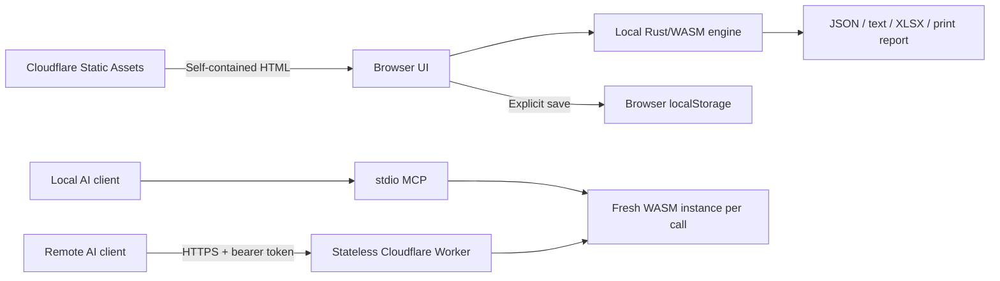
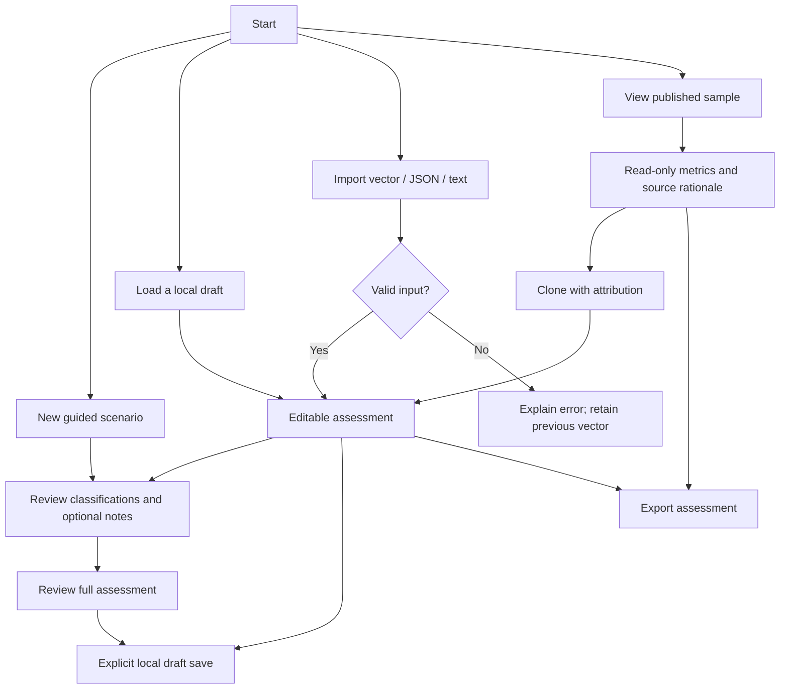

# Design and interaction flows

## Architecture

Rust owns vector parsing, defaults, canonicalization, scoring, metric definitions/rendering, and XLSX packaging. The browser adapter owns scenario metadata, device APIs, drafts, notes, and interaction state. The MCP SDK owns protocol negotiation and transport. No JavaScript scoring fallback exists.

FIRST reference files are pinned and hash-verified. Generated metric and lookup files are rebuilt from those sources. Maintained Rust/JS/TS/CSS stay formatted; release LTO/size optimization and esbuild minification happen at build time. CSP hashes cover the exact packaged script. The offline edition includes all assets and license notices.

## Assessment paths

The starting wizard values are placeholders until reviewed. Provisional status stays visible until all Base metrics are confirmed. Metric notes are optional and do not affect scores. Navigating steps retains notes. Invalid vectors preserve the prior valid assessment. Samples are immutable references; clones preserve source identity while creating independent work.

In read-only mode, empty/whitespace metric-note fields are omitted. Source rationale remains visible because it explains the published classification. Nonempty assessor notes remain readable. The notes dialog synchronizes with the inline field and supports native Escape/close behavior.

## Presentation

Use indigo/teal accents with neutral surfaces and explicit light, dark, high-contrast, and forced-color treatments. Red → amber → pale yellow cues express the relative severity tendency of choices, accompanied by arrows and text. Supplemental/Not defined choices are neutral. Individual cues are not independent CVSS scores.

Export buttons combine an accessible text label with a decorative Lucide SVG. SVGs are embedded, not fetched. Layouts wrap on small screens; focus remains visible. Tabs support arrows/Home/End. Print reports use a light surface independent of the screen theme. Contrast tests cover semantic text; Playwright covers desktop engines and a mobile dark viewport. These checks do not claim full WCAG certification.

## Export contracts

JSON preserves a versioned vector envelope plus scenario title, notes, sample attribution, and metric notes. Imported score fields are ignored and recomputed. Text imports recover the vector; PDF is a printable report; XLSX contains all 32 metrics, definitions, effective values, rationales, sources, and notes as a static snapshot. Neither PDF nor XLSX is an assessment-import format.
